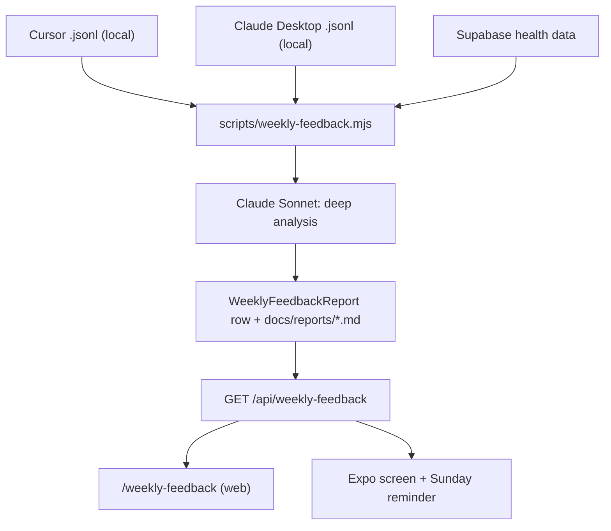

# Weekly Feedback Loop

A weekly "deep feedback" report that combines two things into one read:

1. **Health & life** — a Claude-written analysis of the week's MY PENS data
   (weight, sleep, training, food, mood, Anchor recovery).
2. **Working with Claude** — an analysis of *how you ran your projects* that
   week: prompt volume, prompt quality (did prompts carry files/goals/
   constraints?), tool + subagent usage, and late-night prompting — parsed
   from your local Cursor / Claude Desktop transcripts.

It ends with three wins, three concrete prompting/project improvements, and
three health actions for the coming week. It also surfaces deterministic
**cross-links** (e.g. "late-night prompting tracked with short sleep").

## Why it runs locally

Your health data lives in Supabase (reachable via `DATABASE_URL`), but the
raw material for judging your prompts lives in local `.jsonl` transcript
files under `~/.cursor/projects` and `~/.claude/projects` — which a
Vercel-hosted app cannot read. So the generator runs **on your machine**,
does the analysis, and upserts a finished report into the DB. The web page
and the mobile app are read-only consumers.



## Running it

```bash
npm run feedback:weekly              # current ISO week (Mon–Sun)
node scripts/weekly-feedback.mjs --last          # previous full week
node scripts/weekly-feedback.mjs --week=2026-07-15   # week containing a date
node scripts/weekly-feedback.mjs --dry           # compute + print, no DB write
node scripts/weekly-feedback.mjs --no-ai         # deterministic only, no Claude
```

It always writes a Markdown copy to `docs/reports/weekly-feedback-<weekOf>.md`
(git-ignored — it contains personal health data) and, unless `--dry`, upserts
the `WeeklyFeedbackReport` row for that week.

### Environment

| Var | Required | Purpose |
|-----|----------|---------|
| `DATABASE_URL` | for DB write | Reads health data, upserts the report. Without it the script forces `--dry`. |
| `ANTHROPIC_API_KEY` | optional | Enables the Claude deep analysis. Without it, a solid deterministic report is produced instead. |
| `PENS_TRANSCRIPT_DIRS` | optional | Comma-separated dirs of `.jsonl` transcripts. Defaults to `~/.cursor/projects` and `~/.claude/projects`. |
| `WEEKLY_FEEDBACK_MODEL` | optional | Model id. Default `claude-sonnet-4-6`. |

### Scheduling a true weekly run

Run it every Sunday evening with your OS scheduler. Examples:

- **Windows Task Scheduler** — action: `node`, args:
  `C:\path\to\mypens\scripts\weekly-feedback.mjs`, weekly on Sunday 18:00,
  with `DATABASE_URL` / `ANTHROPIC_API_KEY` set in the task environment.
- **cron (macOS/Linux)** — `0 18 * * 0 cd /path/to/mypens && node scripts/weekly-feedback.mjs`.

## Where it shows up

- **Web:** `/weekly-feedback` — summary, wins/improvements/actions, health and
  Claude-work analysis with metric grids.
- **Mobile (Android/iOS):** a native "Weekly Feedback" screen, reachable from
  the Sleep tab, plus a **local reminder every Sunday at 18:00** that
  deep-links straight into the screen. The reminder is a plain local
  notification (no server push needed); the report is fetched on open.

## Data model

`WeeklyFeedbackReport` (see `prisma/schema.prisma`, migration
`20260718140000_weekly_feedback_report`):

| Field | Notes |
|-------|-------|
| `weekOf` | Monday of the ISO week (unique — re-runs upsert in place) |
| `weekEnd` | Sunday |
| `combinedSummary`, `healthAnalysis`, `claudeWorkAnalysis` | prose |
| `wins`, `improvements`, `healthActions` | JSON arrays (TEXT) |
| `metrics` | JSON blob (TEXT) of the deterministic metrics |
| `model` | model used, or `null` for the deterministic fallback |

## Privacy

- The **generated Markdown reports are git-ignored** (`docs/reports/`) because
  they contain personal health data.
- **Anchor** recovery data is only ever used in **aggregate** (clean-streak
  length, count of drinking days). No notes or event details are sent to the
  model or stored in the report.
- Transcript **contents never leave the script** except as short, truncated
  sample snippets sent to Claude for prompt-quality critique; only aggregate
  counts are stored.
- The API route is behind the same auth as everything else (`proxy.ts`:
  session cookie for web, `MOBILE_PENS_API_TOKEN` bearer for the app).

## Files

| File | Role |
|------|------|
| `scripts/weekly-feedback.mjs` | Generator (health + transcripts → Claude → DB + Markdown) |
| `scripts/lib/transcriptMetrics.mjs` | Parses `.jsonl` transcripts into prompt/project metrics |
| `scripts/lib/weekDates.mjs` | ISO-week date helpers |
| `app/api/weekly-feedback/route.ts` | Read-only API (`?weekOf=`, `?list=1`) |
| `app/weekly-feedback/page.tsx` | Web page |
| `mypens-mobile/app/weekly-feedback.tsx` | Native screen |
| `mypens-mobile/lib/weeklyFeedbackNotifications.ts` | Sunday local reminder |
